# Azure VM Nginx Deployment with Terraform AzureRM Provider

A complete Infrastructure as Code (IaC) project that provisions an Ubuntu 22.04 Virtual Machine running Nginx on Microsoft Azure — with a templated boot script, availability zone placement, and a clean multi-file Terraform layout.

---

## Architecture Overview

```
┌──────────────────────────────────────────────────┐
│                  Azure Cloud                     │
│                                                  │
│   ┌──────────────────────────────────────────┐   │
│   │     Resource Group (avinashsainb15-rg)   │   │
│   │                                          │   │
│   │   ┌──────────────────────────────────┐   │   │
│   │   │  Virtual Network (10.0.0.0/16)   │   │   │
│   │   │                                  │   │   │
│   │   │   ┌──────────────────────────┐   │   │   │
│   │   │   │  Subnet (10.0.1.0/24)    │   │   │   │
│   │   │   │                          │   │   │   │
│   │   │   │  ┌────────────────────┐  │   │   │   │
│   │   │   │  │  NIC ◄── NSG       │  │   │   │   │
│   │   │   │  │  ● SSH  (port 22)  │  │   │   │   │
│   │   │   │  │  ● HTTP (port 80)  │  │   │   │   │
│   │   │   │  └─────────┬──────────┘  │   │   │   │
│   │   │   │            │             │   │   │   │
│   │   │   │  ┌─────────▼──────────┐  │   │   │   │
│   │   │   │  │  Ubuntu 22.04 VM   │  │   │   │   │
│   │   │   │  │  Nginx + HTML      │  │   │   │   │
│   │   │   │  │  Zone 2            │  │   │   │   │
│   │   │   │  └────────────────────┘  │   │   │   │
│   │   │   └──────────────────────────┘   │   │   │
│   │   └──────────────────────────────────┘   │   │
│   │                                          │   │
│   │   ┌────────────────┐                     │   │
│   │   │  Public IP     │ ◄── attached to NIC │   │
│   │   │  (Standard)    │                     │   │
│   │   └────────────────┘                     │   │
│   └──────────────────────────────────────────┘   │
└──────────────────────────────────────────────────┘
```

---

## Project Structure

```
azure-tf-nginx-ubuntu/
    ├── backend.tf            # Terraform + AzureRM provider configuration
    ├── main.tf               # RG, VNet, subnet, public IP, NSG, NIC, VM
    ├── variables.tf          # All input variables
    ├── outputs.tf            # Public IP, SSH command, website URL
    ├── terraform.tfvars      # Variable values (edit before deploying)
    ├── user_data.sh          # VM boot script — installs Nginx + custom HTML
    ├── screenshots/          # Verification screenshots
    └── README.md
```

---

## Resources Created

| Resource | Type | Description |
|---|---|---|
| `azurerm_resource_group.rg` | Resource Group | Container for all project resources |
| `azurerm_virtual_network.vnet` | Virtual Network | Private network `10.0.0.0/16` |
| `azurerm_subnet.subnet` | Subnet | Slice of the VNet `10.0.1.0/24` |
| `azurerm_public_ip.pip` | Public IP | Static, Standard SKU, Zone 2 |
| `azurerm_network_security_group.nsg` | NSG | Allows inbound SSH (22) + HTTP (80) |
| `azurerm_network_interface.nic` | NIC | VM's network card, bound to subnet + public IP |
| `azurerm_network_interface_security_group_association.nsg_attach` | Association | Attaches NSG to the NIC |
| `azurerm_linux_virtual_machine.vm` | Virtual Machine | Ubuntu 22.04 LTS running Nginx, Zone 2 |

---

## Prerequisites

| Requirement | Version | Check |
|---|---|---|
| [Terraform](https://developer.hashicorp.com/terraform/downloads) | ≥ 1.5 | `terraform -version` |
| [Azure CLI](https://learn.microsoft.com/cli/azure/install-azure-cli) | any | `az --version` |
| Azure login | — | `az login` |
| SSH key pair | RSA 4096 | see Step 1 below |

---

## Quick Start

### Step 1 — Generate SSH key pair

```bash
ssh-keygen -t rsa -b 4096 -f ~/.ssh/id_rsa
```

This creates:
- `~/.ssh/id_rsa` — private key *(never share or commit this)*
- `~/.ssh/id_rsa.pub` — public key *(Terraform uploads this to the VM automatically)*

**Screenshot — SSH key generation output**
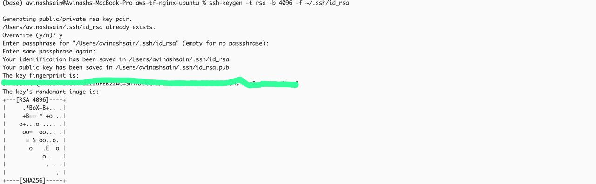

---

### Step 2 — Log in to Azure

```bash
az login
```

**Screenshot — Azure CLI login**
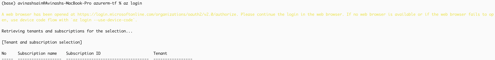

---

### Step 3 — Configure variables

Edit `terraform.tfvars`:

```hcl
subscription_id = "<your-subscription-id>"
project_name    = "avinashsainb15"
location        = "East US"
vm_size         = "Standard_D2s_v3"
html_title      = "Terraform Nginx Server"
html_body       = "<h1>Welcome to the Terraform-managed Nginx Server on Ubuntu</h1><p>Deployed via Terraform service azure.</p>"
```

> **Note:** VM size availability varies per region and subscription. If you hit
> `SkuNotAvailable`, check available sizes with:
> `az vm list-skus --location eastus --size Standard_B --output table`

---

### Step 4 — Deploy

```bash
terraform init
terraform fmt
terraform validate
terraform plan
terraform apply
```

**Screenshot — `terraform init` success**
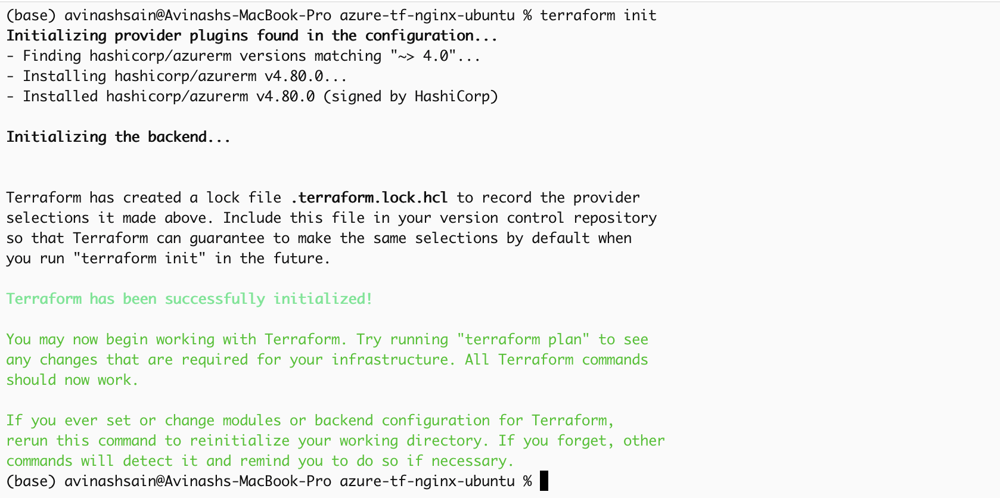

**Screenshot — `terraform fmt` + `terraform validate`**
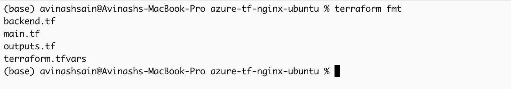
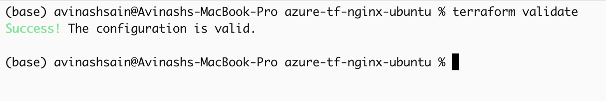

**Screenshot — `terraform plan`**
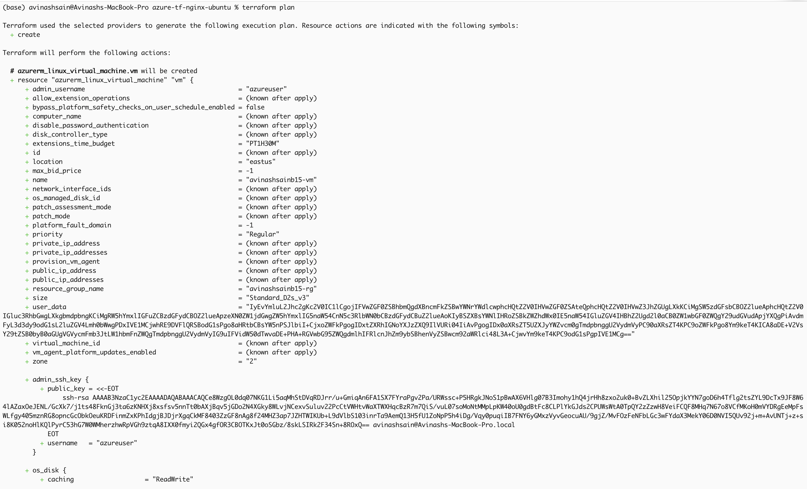
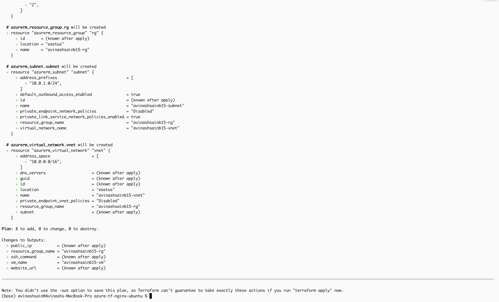

**Screenshot — `terraform apply` complete**

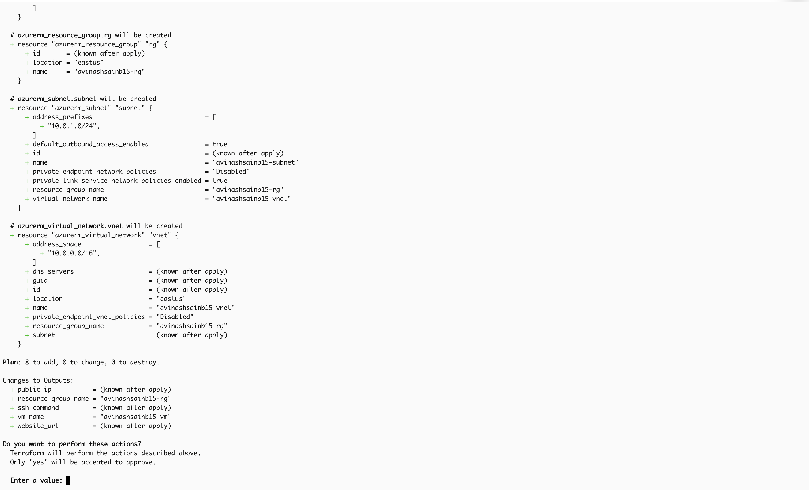

```
Apply complete! Resources: 8 added, 0 changed, 0 destroyed.

Outputs:
public_ip           = "x.x.x.x"
resource_group_name = "avinashsainb15-rg"
ssh_command         = "ssh azureuser@x.x.x.x"
vm_name             = "avinashsainb15-vm"
website_url         = "http://x.x.x.x"
```

**Screenshot — Terraform outputs**
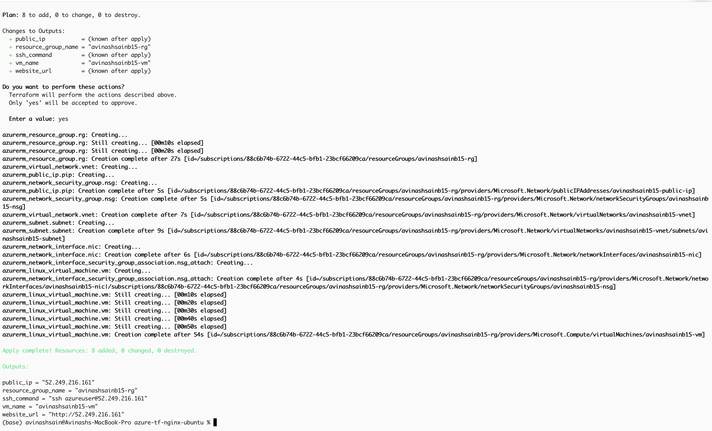

---

### Step 5 — Verify Nginx in browser

Open the `website_url` from the outputs in your browser.

**Screenshot — Nginx running in browser**
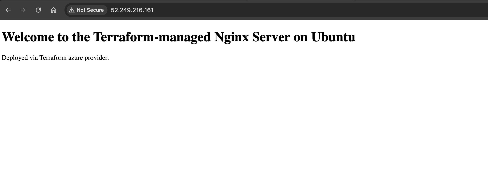

---

### Step 6 — Verify via terminal

```bash
curl http://<public_ip>
```

**Screenshot — curl response**
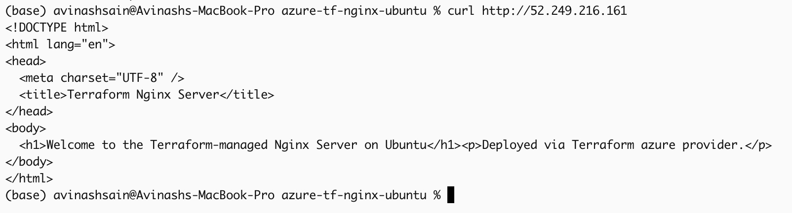

---

### Step 7 — SSH into the VM

```bash
ssh azureuser@<public_ip>
```

Once inside, verify Nginx is active:

```bash
systemctl status nginx
```

**Screenshot — SSH session + Nginx status**
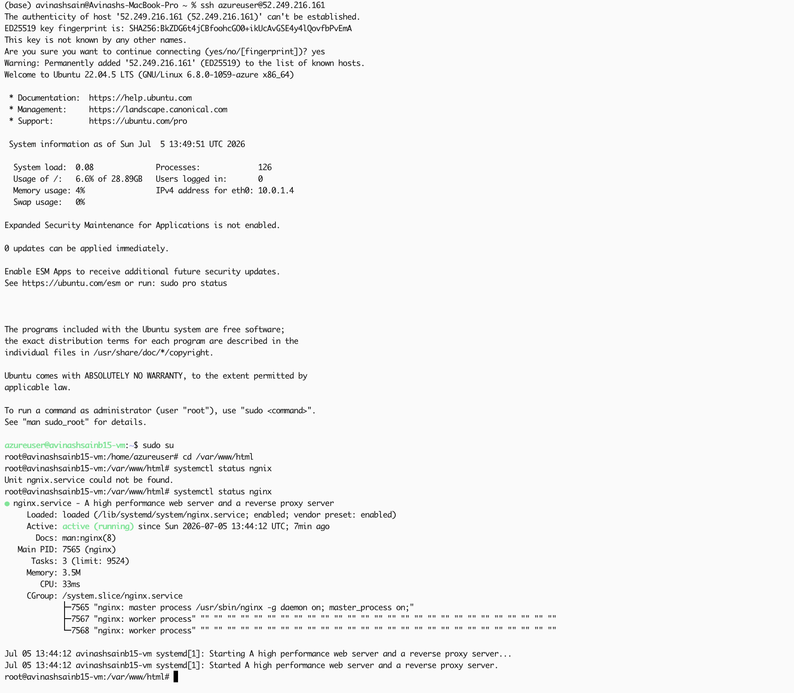

---

### Step 8 — Azure Portal verification

Log into the [Azure Portal](https://portal.azure.com) and verify each resource:

**Screenshot — VM in Azure Portal**
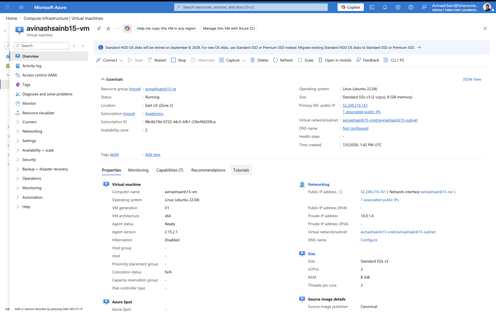

**Screenshot — Resource Group with all resources**
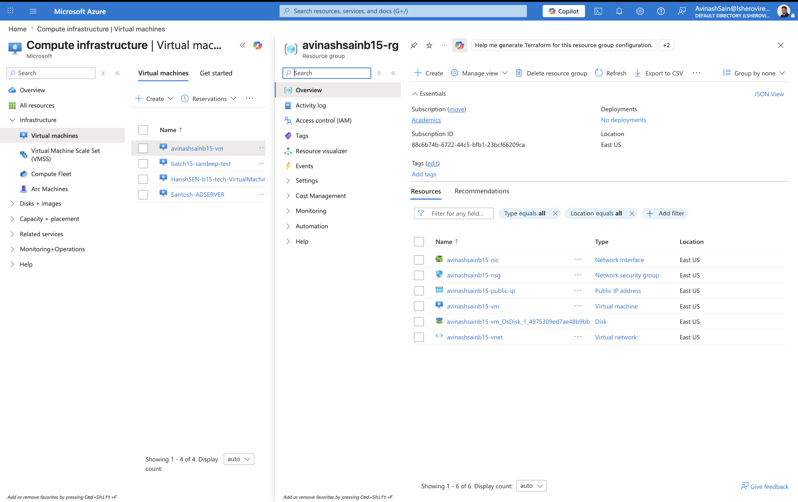

**Screenshot — Resource Visualizer (topology view)**
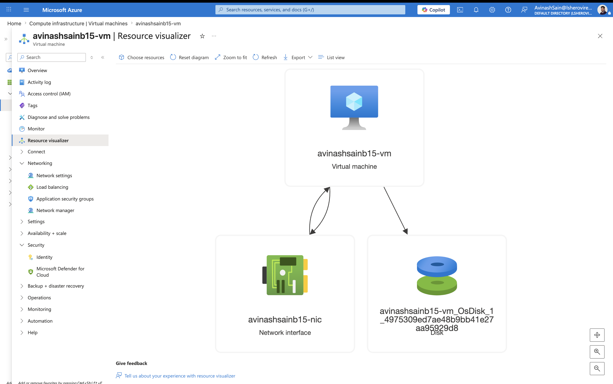

**Screenshot — NSG inbound rules (22 + 80)**
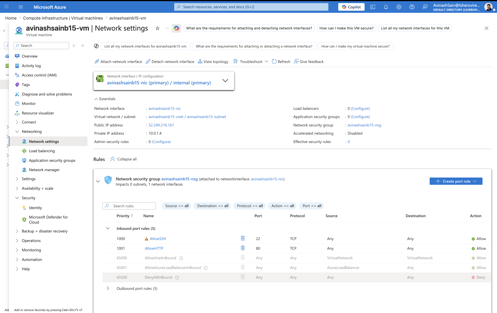

---

### Step 9 — Destroy all resources

```bash
terraform destroy
```

**Screenshot — `terraform destroy` complete**
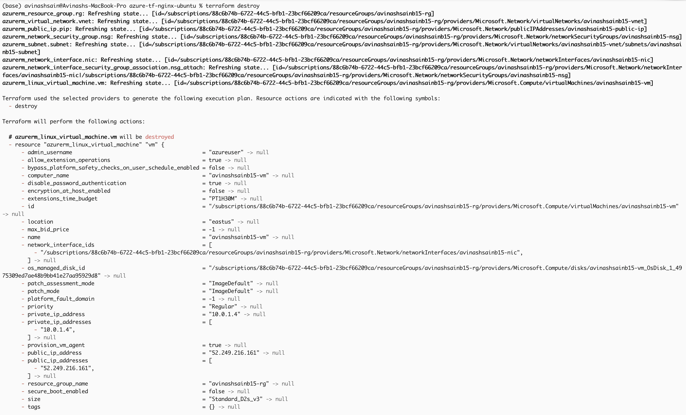
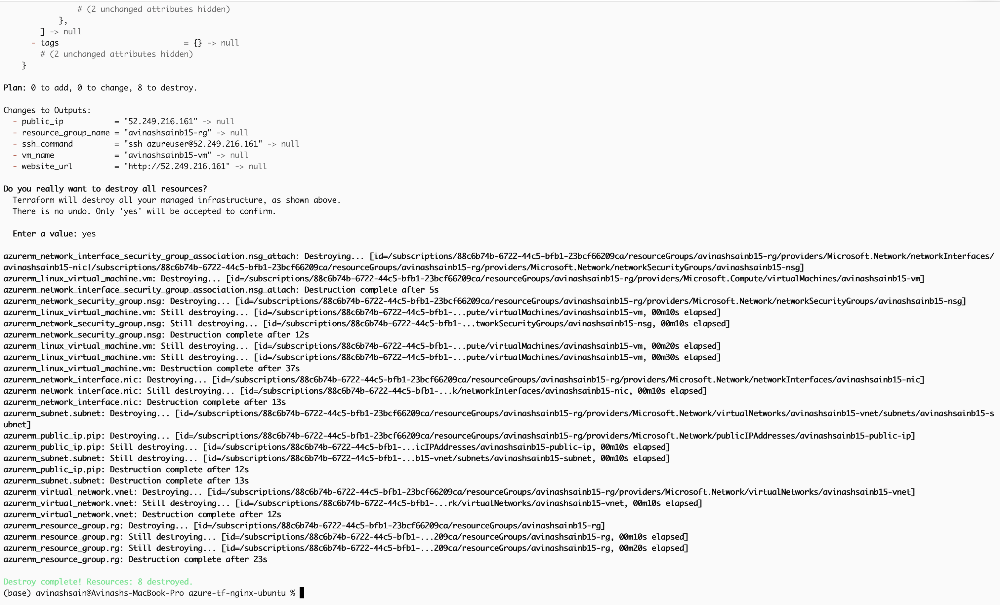

```
Destroy complete! Resources: 8 destroyed.
```

---

## How `user_data.sh` Works

The VM runs `user_data.sh` on first boot via cloud-init. Terraform renders it
as a template using `templatefile()`, injecting the HTML title and body from
variables, then base64-encodes it (required by Azure):

```hcl
user_data = base64encode(templatefile("${path.module}/user_data.sh", {
  html_content_title = var.html_title
  html_content_body  = var.html_body
}))
```

The script itself:

```bash
# Installs and starts Nginx
apt-get update -y && apt-get upgrade -y
apt-get install -y nginx
systemctl enable nginx && systemctl start nginx

# Writes custom HTML page
cat > /var/www/html/index.html <<HTML
  <title>${html_content_title}</title>
  <body>${html_content_body}</body>
HTML
```

---

## Variable Reference

| Variable | Default | Description |
|---|---|---|
| `subscription_id` | — | Azure subscription to deploy into |
| `project_name` | `avinashsainb15` | Prefix used in every resource name |
| `location` | `East US` | Azure region to deploy into |
| `vm_size` | `Standard_D2s_v3` | Virtual machine size |
| `html_title` | `Terraform Nginx Server` | Browser tab title for the Nginx page |
| `html_body` | `<h1>Welcome...</h1>` | HTML body content for the Nginx index page |

---

## Output Reference

| Output | Description |
|---|---|
| `resource_group_name` | Name of the resource group |
| `vm_name` | Name of the virtual machine |
| `public_ip` | Public IP address of the VM |
| `website_url` | Full HTTP URL to access the Nginx server |
| `ssh_command` | Ready-to-run SSH command |

---

## Troubleshooting Notes (learned the hard way)

- **`IPv4BasicSkuPublicIpCountLimitReached`** — Basic public IPs are retired;
  always use `sku = "Standard"`. Standard IPs block all inbound traffic by
  default, so an NSG with explicit Allow rules is mandatory.
- **`SkuNotAvailable` / Capacity Restrictions** — VM sizes vary by region,
  zone, and subscription. Check first with
  `az vm list-skus --location <region> --size Standard_B --output table`,
  or use the Azure Portal's "See all sizes" screen. Capacity is often
  per-zone; this project pins the VM and public IP to **Zone 2**.
- **`expected "user_data" to be a base64 string`** — both `user_data` and
  `custom_data` must be wrapped in `base64encode()`.

---

## Important Notes

- The Standard public IP and the VM are both pinned to **Availability Zone 2**
  (`zones = ["2"]` on the IP, `zone = "2"` on the VM)
- `*.tfstate`, `.terraform/`, and private keys are excluded from Git via `.gitignore`
- Never commit `~/.ssh/id_rsa` (private key) or `terraform.tfvars` with real
  subscription IDs to a public repository
- Remember to run `terraform destroy` when finished — the VM bills hourly

---

> **Assignment:** Azure VM Nginx Deployment with Terraform AzureRM Provider
> **Author:** Avinash Sain
> **GitHub:** https://github.com/Avinashsain
